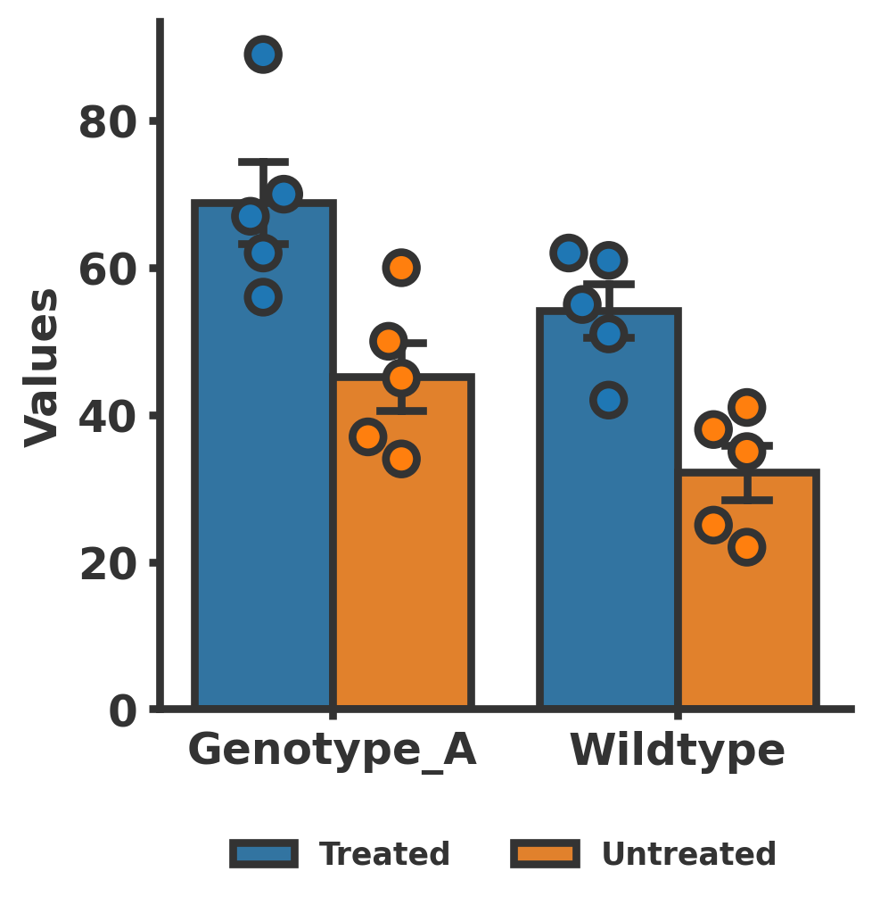

# Bar Plot Generation with Seaborn

This repository contains a Python script that demonstrates how to generate bar plots with swarm points using Seaborn. The script includes two main functionalities:
1. Generating a simple bar plot comparing two groups (Genotype_A vs. Wildtype) with corresponding swarm points for individual data. A Mann-Whitney U test is performed, and the result is annotated on the plot.
2. Generating a grouped bar plot showing Genotype_A vs. Wildtype under two different treatments (Treated vs. Untreated), with swarm points to visualize data distribution.

## Table of Contents
- [Description](#description)
- [Usage](#usage)
- [Dependencies](#dependencies)
- [Functions](#functions)
  - [basic_barplot_comparison](#basic_barplot_comparison)
  - [grouped_barplot_with_treatments](#grouped_barplot_with_treatments)
- [Notes](#notes)
- [License](#license)

## Description

The script `generate_barplots.py` demonstrates how to create visually appealing bar plots with individual data points overlaid as swarm plots. It also includes statistical annotations to highlight significant differences between groups.

## Usage

To run the script and generate the plots, use the following command:

    python generate_barplots.py

The script will generate and save the following plots:
- `bar_test.svg` and `bar_test.png`: Simple bar plot comparing Genotype_A vs. Wildtype.
- `bar_test_big.svg` and `bar_test_big.png`: Grouped bar plot showing Genotype_A vs. Wildtype under Treated vs. Untreated conditions.

## Dependencies

The script requires the following Python libraries:
- `matplotlib`
- `seaborn`
- `pandas`
- `scipy`

You can install the required libraries using `pip`:

    pip install matplotlib seaborn pandas scipy

## Functions

### `basic_barplot_comparison`

This function generates a bar plot with swarm points comparing two groups (Genotype_A vs. Wildtype). It performs a Mann-Whitney U test and annotates the result on the plot.

- **Sample Data**: 
  - Genotype_A values: [67, 56, 62, 70, 89]
  - Wildtype values: [42, 55, 61, 51, 62]

- **Plot Customizations**:
  - Bar colors: Blue (`#1f77b4`) and Orange (`#ff7f0e`)
  - Swarm plot markers: Circles (`o`)
  - Statistical annotation: Mann-Whitney U test result

### `grouped_barplot_with_treatments`

This function generates a grouped bar plot (Genotype_A vs. Wildtype) with two different treatments (Treated vs. Untreated), including swarm points for data distribution.

- **Sample Data**: 
  - Genotype_A values: [67, 56, 62, 70, 89, 45, 37, 50, 60, 34]
  - Wildtype values: [42, 55, 61, 51, 62, 25, 41, 35, 38, 22]

- **Plot Customizations**:
  - Bar colors: Blue (`#1f77b4`) and Orange (`#ff7f0e`)
  - Swarm plot markers: Circles (`o`)
  - Legend: Uses barplot handles to ensure filled color squares

## Notes

- In the grouped bar plot, Seaborn merges the legend entries from both the barplot and the swarmplot. Because the swarmplot uses `facecolors='none'`, the handles appear as unfilled markers in the legend (often hard to see).
- Using `handles[:2]` in `plt.legend` means only the first two items (the barplot handles) are used, ensuring the legend squares are filled in the correct colors.

## License

This project is licensed under the MIT License. See the [LICENSE](LICENSE) file for details.
